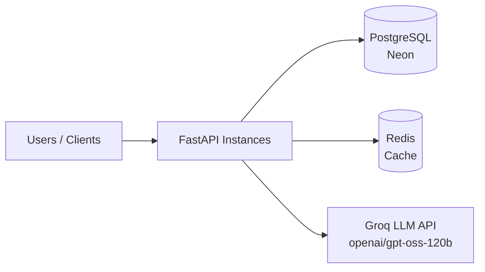
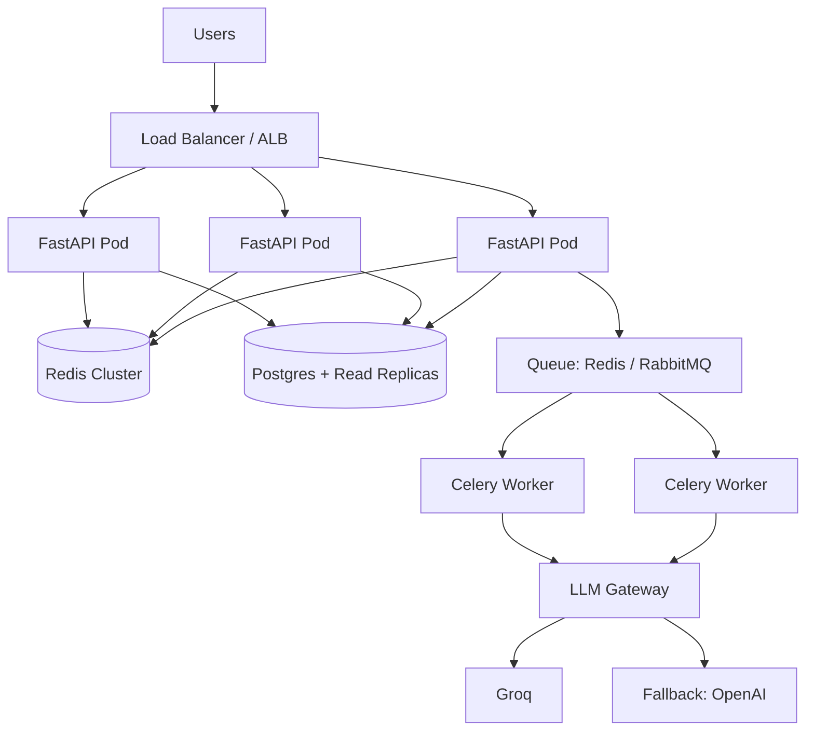
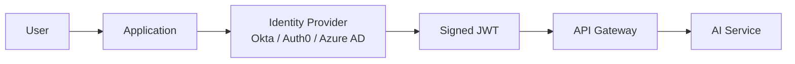

# LLM Question-Answering API

A production-oriented FastAPI service that accepts user questions, sends them to an LLM (Groq), and returns generated answers. Includes JWT authentication, PostgreSQL persistence, Redis caching, and Docker containerization.

---

## Architecture



**Flow:**
1. User authenticates via `POST /auth/login` and receives a JWT.
2. User sends a question to `POST /chat` with the JWT in the `Authorization` header.
3. FastAPI validates the JWT, extracts the user, and checks Redis for a cached answer.
4. On cache miss, the LLM provider calls Groq and returns the answer.
5. The answer is stored in Redis (1h TTL) and logged to PostgreSQL.
6. The response includes the answer, token count, latency, and cache status.

---

## Tech Stack

| Layer | Choice |
|---|---|
| Framework | FastAPI |
| Database | PostgreSQL (Neon, managed) |
| ORM | SQLAlchemy 2.x (async, `asyncpg`) |
| Migrations | Alembic |
| Cache | Redis 7 |
| LLM | Groq (`openai/gpt-oss-120b`) via OpenAI-compatible SDK |
| Auth | JWT (`pyjwt`) + `passlib[bcrypt]` |
| Config | Pydantic Settings + `.env` |
| Packaging | `uv` |
| Containers | Docker + Docker Compose |

---

## Setup

### Prerequisites
- Python 3.12
- [`uv`](https://github.com/astral-sh/uv)
- A Groq API key ([console.groq.com](https://console.groq.com))
- A PostgreSQL database (Neon free tier works)
- Docker Desktop (optional, for the containerized run)

### Local Development

```bash
git clone <your-repo-url>
cd backend
cp .env.example .env       # fill in real values
uv sync
uv run alembic upgrade head
uv run uvicorn app.main:app --reload
```

### Docker

```bash
cd backend
docker compose up --build
```

This starts Redis and the FastAPI backend. The backend connects to Neon for Postgres (configured via `DATABASE_URL`).

Swagger UI: http://localhost:8000/docs

---

## API Endpoints

### `POST /auth/login`
Form-encoded login. Returns a JWT.

**Request:**
```
username=alice&password=alice123
```

**Response:**
```json
{ "access_token": "eyJhbGciOi...", "token_type": "bearer" }
```

### `POST /chat`
Requires `Authorization: Bearer <token>`.

**Request:**
```json
{ "question": "What is FastAPI?" }
```

**Response:**
```json
{
  "answer": "FastAPI is a modern...",
  "model": "openai/gpt-oss-120b",
  "tokens_used": 145,
  "latency_ms": 990,
  "cached": false
}
```

Second identical request returns `"cached": true` with `latency_ms: 0` — served from Redis.

### `GET /health`
Returns `{"status": "ok"}` after confirming DB connectivity.

### `GET /metrics`
Admin-only. Returns aggregate stats (request counts, token usage, latency percentiles). *See "Implemented vs Designed" below.*

---

## Design Decisions

### Why Groq?
- OpenAI-compatible API — one `base_url` change swaps providers.
- Fast inference (LPU hardware), free tier suitable for demo.
- The `openai` SDK is used, **not** a Groq-specific SDK, so switching to OpenAI/OpenRouter/Together requires zero code changes.

### Why a provider interface?
`LLMProvider` is a `Protocol`. `GroqProvider` and `MockProvider` both satisfy it. Benefits:
- **Testability** — unit tests inject `MockProvider`, no network calls.
- **Swappability** — changing LLM vendors touches one file.
- **Isolation** — retry/timeout logic lives inside `GroqProvider`, not scattered.

### Why Redis?
- **Cache** — identical questions return instantly (1h TTL), reducing LLM cost and latency.
- **Graceful degradation** — Redis failures are caught and the app falls back to direct LLM calls, never returning 500.
- **Future use** — distributed rate limiting across multiple FastAPI instances (see Scaling).

### Why async SQLAlchemy?
FastAPI endpoints are `async def`. Sync DB calls block the event loop under concurrency. Async driver (`asyncpg`) matches the async request model, enabling real concurrency.

### Why JWT?
Stateless auth — no server-side session store needed. Scales horizontally without sticky sessions. Each FastAPI instance can validate tokens independently.

---

## Scaling — 100 to 500 RPS

Current implementation handles a single-instance workload. To reach 100–500 RPS:

### Horizontal scaling
Run N FastAPI instances behind a load balancer. Because the app is stateless (JWT + Redis + Postgres), any instance can serve any request.

### Load balancing
An ALB or NGINX distributes traffic. Health checks (`GET /health`) remove unhealthy instances from rotation.

### Kubernetes HPA
Scale pods on CPU **and** custom metrics (queue depth, request latency). Target ~70% CPU; burst to 500 RPS handled by adding pods. `minReplicas: 3` avoids cold-start latency.

### Redis — caching + rate limiting
- **Cache** identical questions (already implemented). At 500 RPS with 30% hit rate, 150 RPS never touch the LLM.
- **Rate limiting** — use `INCR` + `EXPIRE` per user ID. Redis is the coordination layer across instances.

### Background queues
Long-running LLM calls (>3s) are problematic for synchronous HTTP. Introduce a Celery/RQ worker pool:
- `/chat` enqueues a job, returns a `job_id`.
- Client polls `/chat/{job_id}` or receives via WebSocket.
- Workers scale independently of API pods.

For this assignment, synchronous `/chat` is used because it's simpler to demo; the queue pattern is documented for production.

### Rate limiting
Protect both the API and the LLM provider:
- **Per user** — Redis token bucket (e.g., 60 req/min).
- **Global** — cap total outbound requests to Groq under its RPM/TPM limits.

### LLM API limits
Groq's free tier enforces requests-per-minute and tokens-per-minute. Under load:
- Cache aggressively.
- Batch similar prompts (where applicable).
- Queue requests exceeding RPM, process at a steady rate.
- Fall back to a secondary model if the primary is rate-limited.

### Concurrent requests
- Async I/O — many LLM calls in flight per worker.
- Connection pooling (`pool_size=5, max_overflow=10`) prevents overwhelming Postgres.
- HTTP client reuse — one `AsyncOpenAI` instance per worker.

### Failure recovery
- **Retries** — exponential backoff on transient 429/5xx from Groq.
- **Timeouts** — hard cap (e.g., 30s) per LLM call.
- **Fallback** — secondary model if primary unavailable.
- **Circuit breaker** — stop hammering a failing provider; degrade to cached answers only.
- **Graceful degradation** — Redis down → no cache, still works. LLM down → return 503 with retry hint.

### Architecture at 500 RPS



---

## Migration Scenario — 1 EC2, 10 → 10,000 Users

**Current state:** one EC2 instance running everything. Slow under load, single point of failure.

### Migration plan (minimal downtime)

**Phase 1 — Externalize state**
- Move Postgres to RDS (managed, automated backups, read replicas).
- Move Redis to ElastiCache.
- Move secrets to AWS Secrets Manager.
- Deploy is now stateless — the app can restart without losing data.

**Phase 2 — Containerize + orchestrate**
- Package as a Docker image (already done).
- Push to ECR.
- Deploy to ECS Fargate or EKS behind an ALB.
- Rolling deploys — zero downtime.

**Phase 3 — Add async workers**
- Move long LLM calls to a Celery/RQ worker pool (ECS service or K8s deployment).
- `/chat` becomes enqueue-and-poll. Workers scale independently.

**Phase 4 — Observability**
- CloudWatch + Prometheus/Grafana for metrics.
- Structured JSON logs → CloudWatch Logs.
- Alerts on error rate, latency p95, LLM quota usage.

**Phase 5 — Cutover**
- Blue/green deploy: bring up the new stack, switch the ALB target group, drain old instances.
- Migrations run as a one-off ECS task **before** rollout.
- Rollback = switch ALB back.

### Handling LLM API limits
- Cache identical prompts (Redis).
- Rate limit per user (Redis token bucket).
- Queue requests exceeding provider RPM.
- Multi-provider failover via the LLM gateway (Groq primary, OpenAI fallback).

### Handling slow/failing LLM requests
- 30s hard timeout.
- 3 retries with exponential backoff on 5xx/429.
- Fallback to a smaller/faster model.
- Return 504 to the client if all attempts fail; log for analysis.

### Where Redis and queues fit
- Redis — cache, rate limiting, session-adjacent data.
- Queue — decouple slow LLM work from HTTP requests. Workers can run on cheaper instances and scale on queue depth.

### Secrets and configuration
- **Never** in git — `.env` is ignored; `.env.example` documents the shape.
- In production: AWS Secrets Manager or SSM Parameter Store, injected as environment variables at container start.
- Rotation: Secrets Manager supports automatic rotation for DB credentials.

---

## SSO / OIDC Extension

Current implementation: local username/password + JWT.

**Production path:**



- The app **never stores passwords** — the IdP verifies identity.
- IdP issues a signed JWT. The API validates the signature via the IdP's JWKS endpoint.
- Claims (`sub`, `email`, `roles`) are trusted because they're signed.
- The API Gateway can enforce auth before requests reach the AI service.

The current codebase is already close: replace `create_access_token` with verification of an IdP-issued token, and remove `/auth/login`.

---

## RBAC

Three roles, enforced via a `role` claim in the JWT:

| Role | Permissions |
|---|---|
| **Admin** | Manage users/config, access `/metrics`, view all chat logs |
| **User** | Access `/chat`, view own chat history |
| **Read-only** | Access permitted reports/data; cannot call `/chat` |

**Implementation:**
- `role` is stored in the `users` table and included in the JWT payload.
- A dependency factory creates role-checking dependencies:
  ```python
  def require_role(*roles):
      async def checker(user: CurrentUserDep):
          if user.role not in roles:
              raise HTTPException(403, "Insufficient permissions")
          return user
      return checker
  ```
- Endpoints declare their requirement: `user: User = Depends(require_role("admin"))`.

---

## Implemented vs Designed

### Implemented ✅
- JWT auth (`/auth/login`, `/auth/register`)
- LLM integration (`/chat`) with Groq
- Provider interface (`LLMProvider`, `GroqProvider`, `MockProvider`)
- Redis caching with graceful degradation
- PostgreSQL logging of all chat requests
- Alembic migrations
- Docker Compose (backend + Redis)
- `/health` with DB connectivity check

### Designed but not fully built 📝
- `/metrics` endpoint — design above; not implemented
- Redis-based rate limiting — design above; not implemented
- Background queue for async chat — design above; not implemented
- Automated tests — skeleton would use `MockProvider` + `dependency_overrides`
- Retry/timeout logic in `GroqProvider` — currently relies on SDK defaults

These are documented in the Design Decisions and Scaling sections above.

---

## Repository Structure

```
backend/
├── app/
│   ├── api/
│   │   ├── routes/
│   │   │   ├── auth.py
│   │   │   └── chat.py
│   │   └── user_deps.py
│   ├── core/
│   │   ├── redis.py
│   │   ├── security.py
│   │   └── settings.py
│   ├── database/
│   │   ├── base.py
│   │   ├── db.py
│   │   └── deps.py
│   ├── db_models/
│   │   └── models.py
│   ├── schemas_pydantic/
│   │   └── schemas.py
│   ├── services/
│   │   └── llm.py
│   └── main.py
├── alembic/
├── docs/
├── scripts/
├── Dockerfile
├── docker-compose.yml
├── pyproject.toml
└── .env.example
```

---

## Loom Video

[Link to 5-minute walkthrough](https://loom.com/...)